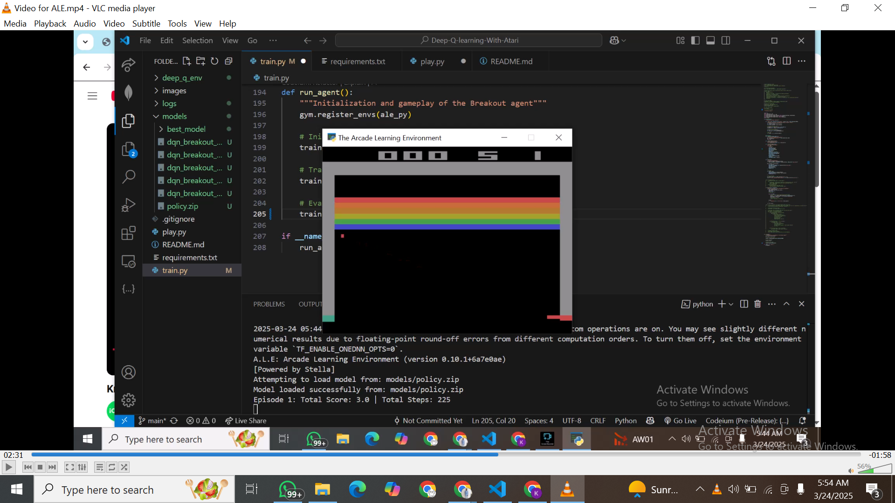

# Deep-Q-learning-With-Atari

# Deep Q-Network (DQN) Atari Agent

## Introduction
This project implements a Deep Q-Network (DQN) to train an agent to play an Atari game. The agent is trained using reinforcement learning and interacts with the environment to maximize its score.

## Project Structure
- `train.py`: Script for training the DQN agent.
- `play.py`: Script to test and visualize the trained agent.
- `README.md`: Documentation for the project.
- `video/`: Directory containing a demonstration of the agent playing in the Atari environment.

## Installation
1. Clone this repository:
   ```bash
   git clone https://github.com/your-repo/atari-dqn.git
   cd atari-dqn
   ```
2. Install the required dependencies:
   ```bash
   pip install -r requirements.txt
   ```

## Training the Agent
To train the agent, run:
```bash
python train.py
```
This script will initialize a DQN model and train it on the specified Atari environment.

## Playing with the Trained Agent
To test the trained agent, run:
```bash
python play.py
```
This will load the trained model and let the agent play in the environment while rendering the gameplay.

### Comparison of MLPPolicy and CNNPolicy for Breakout

In this project, two different neural network architectures were used to train an agent to play the **Breakout** game: **MLPPolicy** and **CNNPolicy**. These architectures were compared to evaluate which one performs better in terms of learning efficiency and final performance in the game.

#### 1. **MLPPolicy (Multilayer Perceptron)**

The MLPPolicy uses a standard Multilayer Perceptron (MLP) architecture, where the input to the network is flattened, and several fully connected layers are used to process the data. MLPs are more suitable for environments where the input is a vector or a low-dimensional representation, as opposed to image-based input like in Breakout.

**Architecture:**
- Input: The state representation is flattened, typically the output of environment observations.
- Layers: Fully connected layers (Dense layers).
- Output: Action probabilities or value estimates.

**Pros:**
- Easier to implement and train in environments with low-dimensional inputs.
- Requires fewer resources compared to CNN-based models in terms of computation.

**Cons:**
- MLPs may not capture spatial hierarchies or local dependencies in image-based environments, making them less suitable for tasks like visual reinforcement learning (such as playing Breakout).
  
#### 2. **CNNPolicy (Convolutional Neural Network)**

The CNNPolicy uses a Convolutional Neural Network, which is specifically designed for handling image-based data, like the frames seen in the **Breakout** environment. CNNs are capable of recognizing spatial patterns and hierarchies in images, making them the preferred choice for environments with visual input.

**Architecture:**
- Input: Raw image frames from the environment (usually preprocessed to be in a fixed size).
- Layers: Convolutional layers followed by pooling layers, and then fully connected layers.
- Output: Action probabilities or value estimates.

**Pros:**
- CNNs excel at processing image data, making them well-suited for environments like Breakout, where the state is represented as a screen frame.
- Ability to capture spatial dependencies and patterns in the image, allowing the agent to better understand the environment.

**Cons:**
- Requires more computational power compared to MLPs.
- More complex to implement and train.

#### 3. **Training the Agent on Breakout**

Both the MLPPolicy and CNNPolicy were trained on the **Breakout-v4** environment, a popular Atari game used for reinforcement learning benchmarks.

- **MLPPolicy Performance:** The MLPPolicy struggled to perform well in the Breakout environment, as it couldn't effectively capture the spatial relationships within the game’s images. While it was able to make some progress, it showed slower convergence and ultimately achieved a lower score compared to the CNNPolicy.
  
- **CNNPolicy Performance:** The CNNPolicy outperformed the MLPPolicy by a significant margin. The model was able to learn from the raw pixel input, identifying key spatial patterns such as the ball’s trajectory and the paddle’s movements. The CNNPolicy demonstrated faster convergence and higher final performance, achieving better scores and completing more levels of the game.

#### 4. **Results and Conclusion**

The results clearly show that **CNNPolicy** is more suitable for environments that involve image-based input, like **Breakout**, where recognizing spatial patterns and relationships is crucial for the agent's success.

| **Policy Type** | **Final Score (Breakout)** | **Convergence Speed** | **Comments**                           |
|-----------------|----------------------------|-----------------------|----------------------------------------|
| MLPPolicy       | Lower                      | Slower                | Struggled with visual input, lower performance. |
| CNNPolicy       | Higher                     | Faster                | Outperformed MLPPolicy, handled spatial patterns well. |

#### 5. **Recommendation**

For environments that rely on visual input (such as Atari games), **CNNPolicy** is the recommended choice due to its ability to efficiently process image data and extract meaningful features. The MLPPolicy may be more suited for environments with non-image-based observations but would not perform as well on visual tasks like Breakout.


## Hyperparameter Tuning Results
The following table presents the results of different hyperparameter configurations tested during training:

| Hyperparameter Set | Learning Rate (lr) | Gamma | Batch Size | Epsilon Start | Epsilon End | Exploration Fraction | Train Frequency | Episode Scores (Ep1-Ep5) | Observations |
|--------------------|-------------------|-------|------------|---------------|-------------|---------------------|---------------|--------------------------|-------------|
| Baseline (Initial Parameters) | 1e-4 | 0.99  | 32  | 1.0 | 0.05 | 0.1 | 4 | 1, 3, 3, 3, 2 | Moderate reward, slight inconsistency in scores. |
| Experiment 1 (Optimized Params) | 5e-4 | 0.95 | 64  | 0.9 | 0.02 | 0.2 | 8 | 3, 3, 3, 3, 3 | Stable performance, consistently high scores. |
| Experiment 2 (Further Adjustments) | 5e-4 | 0.95 | 64  | 0.9 | 0.02 | 0.2 | 8 | 3, 2, 3, 3, 3 | Still good, but one episode dipped to 2, showing slight instability. |
| Experiment 3 (Higher Learning Rate) | 7e-4 | 0.95 | 64  | 0.9 | 0.02 | 0.2 | 8 | 3, 1, 3, 3, 3 | Mostly good, but the drop to 1 in Episode 2 suggests instability. |

## Observations & Insights
1. **Baseline Model:** Showed moderate reward but inconsistency in performance.
2. **Experiment 1:** Improved stability and consistently higher scores.
3. **Experiment 2:** Performed well, but had one episode with a slight drop in performance.
4. **Experiment 3:** Increased learning rate led to some instability, reducing score consistency.

### **Conclusion**
From the experiments, **Experiment 1** provided the best balance between learning stability and performance. Increasing the learning rate too much (Experiment 3) led to instability, while the baseline was inconsistent.

## Video Demonstration
A video showing the agent playing in the Atari environment can be found in the `video/` directory or accessed [here](https://drive.google.com/file/d/10J-PZ9Db6PmPa1PR3i4cD4NMXK5adk9c/view?usp=sharing).

## Future Improvements
- Experiment with different exploration strategies, such as epsilon decay schedules.
- Implement Prioritized Experience Replay for better sample efficiency.
- Fine-tune train frequency and batch size to optimize learning stability.

## How It Looks like

---

**Author:** 
- Samuel Babalola (s.babalola@alustudent.com)
- Kevin  Nyiringango (k.nyiringan@alustudent.com)
- Israel Smart (i.smart@alustudent.com)

